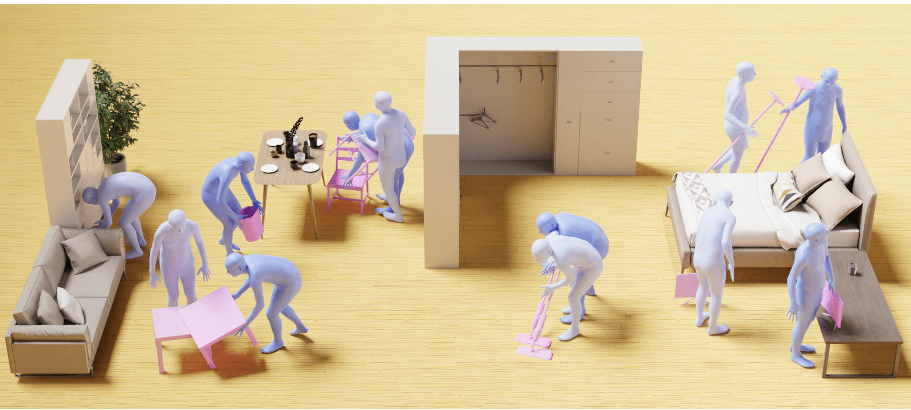

# Object Motion Guided Human Motion Synthesis (SIGGRAPH Asia 2023) 
This is the official implementation for the SIGGRAPH Asia 2023 (TOG) [paper](https://arxiv.org/abs/2309.16237). For more information, please check the [project webpage](https://lijiaman.github.io/projects/omomo/).



## Environment Setup
> Note: This code was developed on Ubuntu 20.04 with Python 3.8, CUDA 11.3 and PyTorch 1.11.0.

Clone the repo.
```
git clone https://github.com/lijiaman/omomo_release.git
cd omomo_release/
```
Create a virtual environment using Conda and activate the environment. 
```
conda create -n omomo_env python=3.8
conda activate omomo_env 
```
Install PyTorch. 
```
conda install pytorch==1.11.0 torchvision==0.12.0 torchaudio==0.11.0 cudatoolkit=11.3 -c pytorch
```
Install PyTorch3D. 
```
conda install -c fvcore -c iopath -c conda-forge fvcore iopath
conda install -c bottler nvidiacub
pip install --no-index --no-cache-dir pytorch3d -f https://dl.fbaipublicfiles.com/pytorch3d/packaging/wheels/py38_cu113_pyt1110/download.html
```
Install human_body_prior. 
```
git clone https://github.com/nghorbani/human_body_prior.git
pip install tqdm dotmap PyYAML omegaconf loguru
cd human_body_prior/
python setup.py develop
```
Install BPS.
```
pip install git+https://github.com/otaheri/chamfer_distance
pip install git+https://github.com/otaheri/bps_torch
```
Install other dependencies. 
```
pip install -r requirements.txt 
```

### Testing
First, please download the [dataset](https://drive.google.com/file/d/1tZVqLB7II0whI-Qjz-z-AU3ponSEyAmm/view?usp=sharing) and put ```data/``` to the root folder. You can check all the [visualizations](https://drive.google.com/file/d/1ek-Kgvtg_NpRKKrfz1WRPy7CKVjHw5wW/view?usp=sharing) of each motion sequence.  

Then, download pretrained [models](https://drive.google.com/file/d/173UXZXdygo4CA5f8oHFXUtwArIdkHEiP/view?usp=sharing) and put ```pretrained_models/``` to the root folder.  

If you would like to generate visualizations, please download [Blender](https://www.blender.org/download/) first. And put blender path to BLENDER_PATH. Replace the BLENDER_PATH in line 7 of ```omomo_release/manip/vis/blender_vis_mesh_motion.py```. 

Please download [SMPL-H](https://mano.is.tue.mpg.de/download.php) (select the extended SMPL+H model), [SMPL-X]() and put the model to ```data/smpl_all_models/```. If you have a different folder path for SMPL-H model, please modify the path in line 24 of ```manip/data/hand_foot_dataset.py```.

Then run OMOMO on the testing data. To enable visualizations, please remove ```--for_quant_eval```. The generated visualization will be in the folder ```omomo_runs```.   
```
sh scripts/test_omomo.sh
```

### Training 
Train stage 1 (generating hand joint position from object geometry). Please replace ```--entity``` with your account name. 
```
sh scripts/train_stage1.sh
```
Train stage 2 (generating full-body motion from hand joint position). Please replace ```--entity``` with your account name. 
```
sh scripts/train_stage2.sh
```

### Citation
```
@article{li2023object,
  title={Object Motion Guided Human Motion Synthesis},
  author={Li, Jiaman and Wu, Jiajun and Liu, C Karen},
  journal={ACM Trans. Graph.},
  volume={42},
  number={6},
  year={2023}
}
```

### Related Repos
We adapted some code from other repos in data processing, learning, evaluation, etc. Please check these useful repos. 
```
https://github.com/lijiaman/egoego_release
https://github.com/lucidrains/denoising-diffusion-pytorch
https://github.com/davrempe/humor
https://github.com/jihoonerd/Conditional-Motion-In-Betweening 
https://github.com/lijiaman/motion_transformer 
``` 
